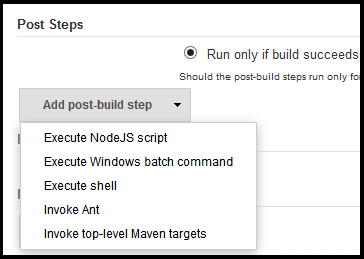
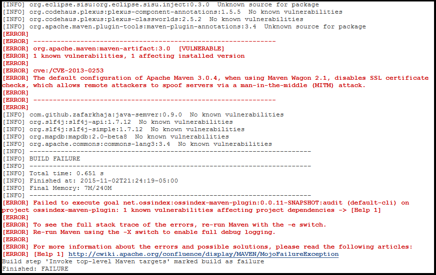

ossindex-maven-plugin
=====================

Audits a [maven](https://maven.apache.org/) project using the [OSS Index REST API](https://ossindex.net) to identify known vulnerabilities in its dependencies.

Requirements
-------------

* Maven 3.1
* An internet connection with access to https://ossindex.net 

[How To Install Apache Maven 3.2.1 On Ubuntu 14.04, Linux Mint 17 And Their Derivative Systems](http://linuxg.net/how-to-install-apache-maven-3-2-1-on-ubuntu-14-04-linux-mint-17-and-their-derivative-systems/)

Depending on your platform and installation details, you may also want to symbolically link maven3 like so:
```
sudo ln -s /usr/bin/mvn3 /usr/bin/mvn
sudo ln -s /usr/share/maven3 /usr/share/maven
```

Usage
-----

```
mvn net.ossindex:ossindex-maven-plugin:audit
```

### Success output
This will run the OSS Index Auditor against the applicable maven project. A successfull
scan finding no errors will look something like this:

```
[INFO] Scanning for projects...
[INFO]
[INFO] Using the builder org.apache.maven.lifecycle.internal.builder.singlethreaded.SingleThreadedBuilder with a thread count of 1
[INFO]
[INFO] ------------------------------------------------------------------------
[INFO] Building net.ossindex:heuristic-version 0.0.7-SNAPSHOT
[INFO] ------------------------------------------------------------------------
[INFO]
[INFO] --- ossindex-maven-plugin:0.0.10:audit (default-cli) @ heuristic-version ---
[INFO] OSS Index dependency audit
[INFO] com.github.zafarkhaja:java-semver:0.9.0  No known vulnerabilities
[INFO] org.slf4j:slf4j-api:1.7.12  No known vulnerabilities
[INFO] org.slf4j:slf4j-simple:1.7.12  No known vulnerabilities
[INFO] org.slf4j:slf4j-api:1.7.12  No known vulnerabilities
[INFO] junit:junit:4.12  No known vulnerabilities
[INFO] org.hamcrest:hamcrest-core:1.3  No known vulnerabilities
[INFO] ------------------------------------------------------------------------
[INFO] BUILD SUCCESS
[INFO] ------------------------------------------------------------------------
```

### Error output
If a vulnerability is found that might impact your project, the output will resemble the
following, where the package and vulnerability details depends on what is identified.

```
...
[INFO] org.eclipse.sisu:org.eclipse.sisu.inject:0.3.0  Unknown source for package
[INFO] org.codehaus.plexus:plexus-component-annotations:1.5.5  No known vulnerabilities
[INFO] org.codehaus.plexus:plexus-classworlds:2.5.2  No known vulnerabilities
[INFO] org.apache.maven.plugin-tools:maven-plugin-annotations:3.4  Unknown source for package
[ERROR] 
[ERROR] --------------------------------------------------------------
[ERROR] org.apache.maven:maven-artifact:3.0  [VULNERABLE]
[ERROR] 1 known vulnerabilities, 1 affecting installed version
[ERROR] 
[ERROR] cve:/CVE-2013-0253
[ERROR] The default configuration of Apache Maven 3.0.4, when using Maven Wagon 2.1, disables SSL certificate checks, which allows remote attackers to spoof servers via a man-in-the-middle (MITM) attack.
[ERROR] 
[ERROR] --------------------------------------------------------------
[ERROR] 
[INFO] org.codehaus.plexus:plexus-utils:3.0.20  No known vulnerabilities
[INFO] org.apache.maven:maven-project:3.0-alpha-2  No known vulnerabilities
...
[INFO] ------------------------------------------------------------------------
[INFO] BUILD FAILURE
[INFO] ------------------------------------------------------------------------
[INFO] Total time: 0.651 s
[INFO] Finished at: 2015-11-02T21:24:19-05:00
[INFO] Final Memory: 7M/240M
[INFO] ------------------------------------------------------------------------
[ERROR] Failed to execute goal net.ossindex:ossindex-maven-plugin:0.0.11-SNAPSHOT:audit (default-cli) on project ossindex-maven-plugin: 1 known vulnerabilities affecting project dependencies -> [Help 1]
[ERROR] 
[ERROR] To see the full stack trace of the errors, re-run Maven with the -e switch.
[ERROR] Re-run Maven using the -X switch to enable full debug logging.
[ERROR] 
[ERROR] For more information about the errors and possible solutions, please read the following articles:
[ERROR] \[Help 1] http://cwiki.apache.org/confluence/display/MAVEN/MojoFailureException
Build step 'Invoke top-level Maven targets' marked build as failure
Finished: FAILURE
```

### Unknown source output

The "Unknown source for package" message can mean one of a few things.

```
...
[INFO] net.ossindex:heuristic-version:0.0.6  Unknown source for package
[INFO] org.codehaus.woodstox:wstx-asl:3.2.6  Unknown source for package
...
```

1. The package belongs to you and is not open source or available to OSS Index
2. The package is known to OSS Index, but requires initialization (see "Package Initialization", below)
3. The package is not known to OSS Index


Integration into Jenkins
------------------------

A simple way to integrate with Jenkins is as "post-build step", specifically
under the "Invoke top-level Maven targets".



* Go to the configuration for your Jenkins project
* Find and click the "Add post-build step" drop down
* Select "Invoke top-level Maven targets"
* Enter "net.ossindex:ossindex-maven-plugin:audit" as the goal
* Select Apply/Save and re-run your build


If a vulnerability is detected in a dependency the build will indicate a failure and
log output for the build will contain something like this:



Package Initialization
----------------------

OSS Index has vast stores of information about packages, vulnerabilities, and source repositories. Notification by ossindex-maven-plugin about these vulnerabilities require that this information be cross referenced with each other, which requires some manual intervention.

If a requested package is open source, then it is queued on OSS Index servers and marked as requested. Our auditors will provide the required cross references as they are requested, though it may take a few days depending on load. Once the references are created they are persistent and do not require rebuilding.

You should see the "Unknown source for package" messages disappearing. If such a message
persists over a long time then either the package remains unknown or we cannot find related
sources.

OSS Index will be providing an interface that will allow users to help improve results by
adding unknown sources, packages, and vulnerabilities. Stay tuned!